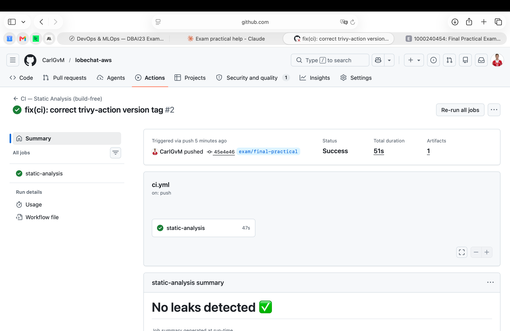

# CI Reasoning — Build-Free Static-Analysis Pipeline

## Evidence

- **Run URL:** https://github.com/CarlGvM/lobechat-aws/actions/runs/26869609538
- **Commit SHA:** `45e4e46`
- **Branch:** `exam/final-practical`

---

## Part A — Why what I did matters (repository-specific)

### 1. Hadolint — `dockerfiles/mcphub.Dockerfile`

Hadolint flags three concrete risks in this eight-line Dockerfile:

- **Line 1: `FROM samanhappy/mcphub:latest`** — the `:latest` tag is mutable. A compromised or broken upstream push silently changes what this image contains. Pinning to a digest (`@sha256:…`) or a versioned tag ensures reproducible builds and blocks supply-chain tag-swap attacks.
- **Line 5: `USER root`** — the runtime process runs as root inside the container. If an attacker escapes through MCPHub, they land as root, which widens the blast radius to the Docker socket and host filesystem mounts.
- **Line 7: `apt-get install … docker.io gcc`** — installing the Docker CLI and a compiler into a runtime image expands the attack surface. `docker.io` gives a container-escape vector if the Docker socket is mounted; `gcc` enables an attacker to compile exploit code on the spot.

### 2. Hadolint — `dockerfiles/sandbox.Dockerfile`

This Dockerfile downloads three binaries from "latest" URLs with no version pin or checksum verification:

- **Lines 42–45 (`kubectl`):** fetches the version string from `https://dl.k8s.io/release/stable.txt`, then downloads that binary. No integrity check (`sha256sum`) — a MITM or CDN compromise delivers a trojaned `kubectl`.
- **Lines 48–53 (`eksctl`):** `curl … releases/latest/download/eksctl_Linux_…` — "latest" is a GitHub redirect that can change at any moment. No checksum.
- **Lines 56–63 (`zellij`):** identical pattern — `releases/latest/download/…`, no version pin, no checksum.
- **Lines 19–21:** grants `NOPASSWD` sudo to the `oriol` user (`echo 'oriol ALL=(ALL) NOPASSWD:ALL'`). Any code execution inside the sandbox container immediately escalates to root without a password prompt.

### 3. Docker Compose config — `docker-compose.yml`

The `docker compose config -q` gate validates that the Compose schema is syntactically correct and that all `${VAR}` interpolations resolve. In this repo the concrete risk is **silent misconfiguration at deploy time**: the file references over a dozen environment variables (`NEXT_AUTH_SECRET`, `AUTH_CASDOOR_ID`, `AUTH_CASDOOR_SECRET`, `OPENROUTER_API_KEY`, `HF_TOKEN`, etc.) that, if undefined, would either break service startup or silently disable authentication.

Additionally, the gate catches structural errors — for example, a mistyped `depends_on` condition or an invalid port mapping — before any container is built or started.

### 4. Gitleaks — secret scan across git history

Gitleaks scans the entire git history for accidentally committed credentials. In this repository:

- **`docker-compose.yml:103`** bind-mounts `~/.aws:/root/.aws:ro` into the `mcphub` container, meaning AWS credentials flow through the host filesystem.
- **`.env.example`** contains commented placeholders for `AWS_ACCESS_KEY_ID`, `AWS_SECRET_ACCESS_KEY`, and `AWS_SESSION_TOKEN` (lines 55–57).
- **`.gitignore`** correctly excludes `.env`, `aws_credentials.yaml`, `*.pem`, and `config/ssh/`, so on a clean working tree gitleaks finds no committed secrets — which is the expected result. The gate's value is **continuous verification** that this protection has never been violated across the full commit history.

### 5. Trivy config — misconfiguration scan on Dockerfiles and Compose

Trivy in `config` mode inspects infrastructure-as-code files for security misconfigurations:

- **`docker-compose.yml:13`**: `sslmode=disable` on Casdoor's Postgres connection string (`dataSourceName=… sslmode=disable dbname=casdoor`). Database traffic between Casdoor and Postgres travels unencrypted — an attacker with network access can sniff SSO credentials and session data.
- **`docker-compose.yml:21`**: `image: lobehub/lobe-chat-database` has **no tag at all**, defaulting to `:latest`. This means every `docker compose pull` can silently change the running application version.
- **Unpinned images**: `qdrant/qdrant:latest` (line 109) and `minio/minio:latest` (line 185) carry the same mutable-tag risk.
- **Note on locally-built images**: `lobechat-aws-mcphub:latest` (line 80) and `lobechat-aws-linux-sandbox:latest` (line 209) are **built locally** from the repo's Dockerfiles, so the `:latest` tag here refers to the local build output, not a pulled registry image. The unpinned-pull risk lives in the Dockerfile `FROM` line, not in the compose service declaration.

### 6. Trivy fs — dependency vulnerability scan

Trivy in `fs` mode scans the repository's dependency manifests (`pyproject.toml`, `package.json`, etc.) for known CVEs. The `pyproject.toml` declares `pytest>=8.0.0`, `openai>=1.0.0`, and `httpx>=0.27.0` as test dependencies — any of these could carry a known vulnerability that Trivy flags. This gate ensures known-vulnerable packages are surfaced before code reaches production.

### 7. Conventional Commits check (`cz`) — mirrors `.githooks/commit-msg`

The repo enforces a local commit-message convention via `.githooks/commit-msg`, which runs `cz check --commit-msg-file`. The CI gate mirrors this by running `uv run cz check -m "$(git log -1 --pretty=%B)"`, using the `[tool.commitizen]` configuration in `pyproject.toml` (name = `cz_conventional_commits`, version = `0.6.0`). This ensures that commits pushed directly (bypassing the local hook) or made via the GitHub UI still conform to the convention, keeping `CHANGELOG.md` generation and `cz bump` version management reliable.

---

### Why the pipeline is build-free

The `vllm` service (line 152: `image: vllm/vllm-openai:gemma4`) requires an NVIDIA GPU and declares a `start_period: 300s` health check — a 5-minute cold start. The 11-service dependency graph (`casdoor → postgres`, `lobe-chat → postgres + minio + casdoor`, `mcphub → sandbox`, `hayhooks → qdrant`, etc.) means even a partial stack startup demands significant resources and time. Standard GitHub-hosted runners provide no GPU and limited RAM. Running `docker compose up` or `docker build` would either fail immediately or time out, producing no useful signal. Static-analysis gates extract maximum value from a free runner without starting anything.

### Why `tests/` are excluded

The `tests/` directory contains **live-stack integration tests**, not unit tests. For example, `tests/test_vllm.py` imports `openai` and `httpx` and hits running endpoints such as vLLM `/health`. These tests require the full 11-service stack to be running with a GPU-backed model loaded. They cannot execute in a build-free CI environment and are therefore deliberately excluded from this workflow.

### Why the Compose interpolation fix is safe

The workflow runs `cp .env.example .env` before `docker compose config -q`. The `.env.example` file contains only dummy placeholder values (e.g., `KEY_VAULTS_SECRET=Y2hhbmdl…`, `AUTH_CASDOOR_ID=your-casdoor-app-id`). The real `.env` file is excluded from version control by `.gitignore`, so no actual secrets are committed. The dummy values exist solely to satisfy variable interpolation during schema validation.

---

## Part B — What is missing for a real production CI/CD (delivery)

What I built is **Continuous Integration**: static quality and security gates that run on every push and pull request to catch defects early. It **stops short of Continuous Delivery/Deployment** — there is no build stage, no artifact registry, no deployment mechanism, no environment promotion, and no post-deploy verification. Below are the concrete additions required to turn this into a production delivery pipeline for this specific system.

### 1. Build, push, sign, and SBOM the locally-built images

`dockerfiles/mcphub.Dockerfile` and `dockerfiles/sandbox.Dockerfile` produce two images referenced in `docker-compose.yml` at lines 80 (`lobechat-aws-mcphub:latest`) and 209 (`lobechat-aws-linux-sandbox:latest`). Today these are built locally with `docker compose build` and never pushed to a registry. A real pipeline must build these images in CI, push them to a container registry (e.g., AWS ECR), sign them with `cosign`, and generate an SBOM (e.g., via `syft`). Additionally, the pulled images with mutable tags — `lobehub/lobe-chat-database` (line 21, no tag at all), `qdrant/qdrant:latest` (line 109), `minio/minio:latest` (line 185) — must be resolved to immutable `@sha256:…` digests so that every deployment is reproducible.

### 2. Federate to AWS via GitHub OIDC — eliminate static credentials

`docker-compose.yml:103` bind-mounts `~/.aws:/root/.aws:ro` into the `mcphub` container, and `.env.example` (lines 55–57) has commented `AWS_ACCESS_KEY_ID` / `AWS_SECRET_ACCESS_KEY` / `AWS_SESSION_TOKEN` placeholders. This pattern relies on long-lived static credentials sitting on the host. A production pipeline should use **GitHub OIDC federation** with an IAM role, so CI carries **no standing credentials** — tokens are scoped, short-lived, and auditable.

### 3. Inject secrets at deploy time from SSM Parameter Store / Secrets Manager

The final project mandate (§2.2) requires secrets to come from SSM Parameter Store or AWS Secrets Manager. Currently the stack reads secrets from a `.env` file on the host. A deploy stage must pull secrets from the managed store at deploy time and inject them as environment variables or write them to a protected `.env` — never baking them into the CI pipeline or the image layers.

### 4. Database migration stage with approval gate

The `db/flyway/` directory contains a migration toolchain, including `db/flyway/provision.sh` which has a destructive `clean` operation that drops all data. A production pipeline must run migrations as a discrete stage **after** deployment of the new application version, with a **manual approval gate** protecting the destructive `clean` path. Versioned migrations in `db/flyway/migrations/` should be applied automatically; `clean` should require explicit human authorization via GitHub Environments / required reviewers.

### 5. Environment promotion: dev → stage → prod with manual approval

The final project Q2 describes a three-environment architecture (dev, stage, prod). Today there is no promotion flow. A real pipeline needs: feature branches deploy to dev automatically; a merge to a release branch triggers stage deployment with integration tests; prod deployment requires a manual approval gate using GitHub protected environments. Branch protection rules should require the CI status checks to pass before merge.

### 6. Deploy mechanism to the target EC2

Currently there is no deploy step. The target is a single EC2 instance running the stack behind a reverse proxy (port 47000 closed to the public, only 80/443 exposed). A deploy stage should use **AWS SSM Run Command** or **SSH** to execute `docker compose pull && docker compose up -d` on the EC2 instance, with a health check waiting for the services to respond before marking the deployment successful.

### 7. Post-deploy smoke tests and health gates

Several services in `docker-compose.yml` lack healthcheck definitions. After deployment, the pipeline should run the live-stack integration tests in `tests/` (e.g., `tests/test_vllm.py` hitting the `/health` endpoint) against the deployed environment to verify end-to-end functionality. These tests are excluded from the current build-free CI precisely because they need a running stack — they belong in a **post-deploy verification stage**.

### 8. Automated rollback — bake the monkeypatch into the image

`docker-compose.yml:27` mounts `./patches/route.js` as a bind-mount monkeypatch over LobeChat's compiled route handler: `./patches/route.js:/app/.next/server/app/(backend)/trpc/tools/[trpc]/route.js:ro`. This is a ~3 MB committed blob that overrides application code at runtime. A real pipeline should bake this patch into a **forked, version-pinned** LobeChat image built from a custom Dockerfile, so rollback is simply pointing to the previous image tag — not hoping the right file is present on the host filesystem.

---

### Prioritisation — single highest-value next step

The single highest-value next step is **building and pushing the locally-built images (`mcphub` and `sandbox`) to a container registry (ECR) with immutable, versioned tags**. Without this, there is no deployable artifact that can be promoted across environments, rolled back, audited, or scanned post-build. Every other CD capability — environment promotion, automated rollback, deploy-time secret injection — depends on having a registry-hosted, version-pinned image as the unit of deployment. Today the deploy unit is a local `docker compose build` plus a bind-mounted monkeypatch (`patches/route.js`), which is neither reproducible nor portable. Pushing to ECR with digest-pinned tags is the foundation that unlocks everything else.
