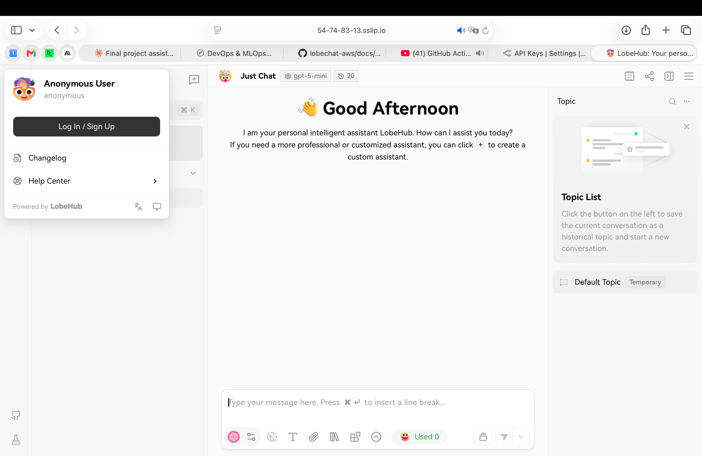

# Final Project — Evidence Report

## 1. Identity

| Field | Value |
|---|---|
| Student name | Carl Graf von Moltke |
| ESADE email | carlleonard.grafvonmoltke@alumni.esade.edu |
| GitHub repo URL | https://github.com/CarlGvM/lobechat-aws (private; user `joseporiolrius` invited as collaborator) |
| Latest commit SHA | `45a1bf34e6c1ca34f33f5bf0c7d094aecc806a13` |
| Final tag | `final-v1.0.0` |

## 2. Public URL

**[https://54-74-83-13.sslip.io](https://54-74-83-13.sslip.io)**

## 3. Screenshot — LobeChat over HTTPS, logged in

<!--
  Frame must show:
    - browser address bar with padlock + the public HTTPS URL
    - LobeChat home page after Casdoor login
    - your ESADE email visible (browser profile, account menu, or terminal
      next to the browser with the prompt)
  Commit as: lobechat-https.png
-->



## 4. Screenshot — chat working (streaming + MCP)

<!--
  One frame showing:
    - a chat reply that streamed (any model)
    - one MCP tool call result rendered in the same chat
  Commit as: chat-mcp.png
-->


## 5. Public reachability — `curl -sI https://<host>/`

```
$ curl -sI https://54-74-83-13.sslip.io/
HTTP/2 307
alt-svc: h3=":443"; ma=2592000
date: Tue, 02 Jun 2026 17:53:13 GMT
location: /chat
via: 1.1 Caddy
```

## 6. Negative test — port 47000 closed

```
$ curl -v --max-time 5 http://54.74.83.13:47000/
*   Trying 54.74.83.13:47000...
* Connection timed out after 5004 milliseconds
* Closing connection
curl: (28) Connection timed out after 5004 milliseconds
```

## 7. Stack runtime — `docker compose ps`

Reverse proxy: Caddy runs as a systemd service (`caddy.service`, active since 2026-06-02 14:11 UTC), not inside Docker Compose.

```
$ cd /opt/lobechat && docker compose ps
NAME              IMAGE                               COMMAND                  SERVICE           CREATED       STATUS                 PORTS
casdoor           casbin/casdoor:v2.13.0              "/server /bin/sh -c …"   casdoor           3 hours ago   Up 3 hours             0.0.0.0:47002->8000/tcp, [::]:47002->8000/tcp
hayhooks          deepset/hayhooks:v1.1.0             "hayhooks run --host…"   hayhooks          4 hours ago   Up 4 hours             0.0.0.0:47012->1416/tcp, [::]:47012->1416/tcp
hayhooks-mcp      deepset/hayhooks:v1.1.0             "sh -c 'pip install …"   hayhooks-mcp      4 hours ago   Up 4 hours             1416/tcp, 0.0.0.0:47013->1417/tcp, [::]:47013->1417/tcp
linux-sandbox     lobechat-aws-linux-sandbox:latest    "tail -f /dev/null"      linux-sandbox     4 hours ago   Up 4 hours
lobe-chat         lobehub/lobe-chat-database:latest    "/bin/node /app/star…"   lobe-chat         3 hours ago   Up 3 hours             0.0.0.0:47000->3210/tcp, [::]:47000->3210/tcp
mcphub            lobechat-aws-mcphub:latest           "/usr/local/bin/entr…"   mcphub            4 hours ago   Up 4 hours             0.0.0.0:47008->3000/tcp, [::]:47008->3000/tcp
minio             minio/minio:latest                   "/usr/bin/docker-ent…"   minio             3 hours ago   Up 3 hours (healthy)   0.0.0.0:47005->9000/tcp, 0.0.0.0:47006->9001/tcp, [::]:47005->9000/tcp, [::]:47006->9001/tcp
qdrant            qdrant/qdrant:latest                 "./entrypoint.sh"        qdrant            4 hours ago   Up 4 hours (healthy)   0.0.0.0:47010->6333/tcp, 0.0.0.0:47011->6334/tcp, [::]:47010->6333/tcp, [::]:47011->6334/tcp
shared-postgres   pgvector/pgvector:pg16               "docker-entrypoint.s…"   postgres          4 hours ago   Up 4 hours (healthy)   0.0.0.0:47003->5432/tcp, [::]:47003->5432/tcp
```

Caddy reverse proxy status:

```
$ systemctl status caddy
● caddy.service - Caddy
     Loaded: loaded (/usr/lib/systemd/system/caddy.service; enabled; preset: enabled)
     Active: active (running) since Tue 2026-06-02 14:11:15 UTC; 3h 50min ago
   Main PID: 24081 (caddy)
```
