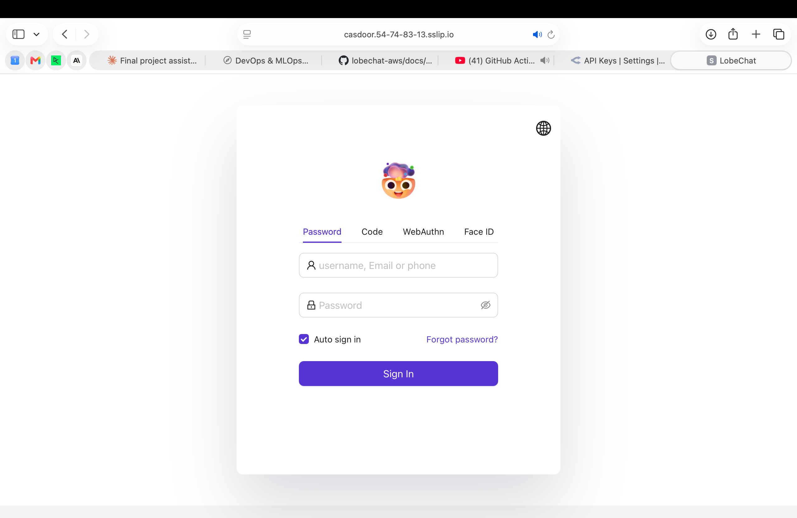
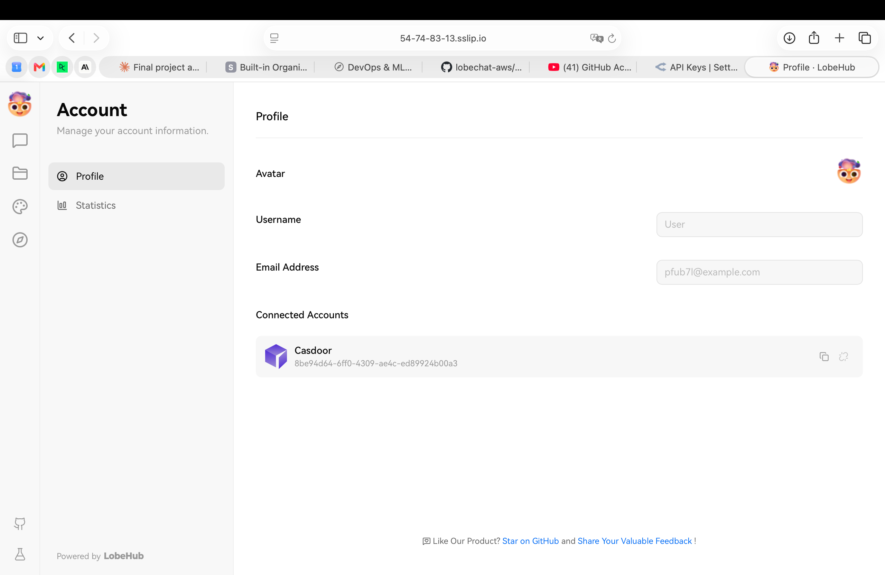
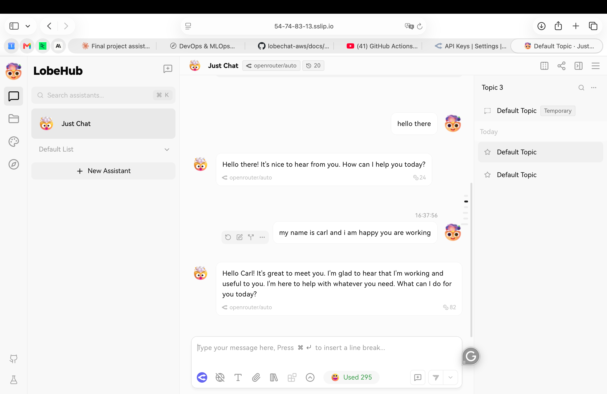
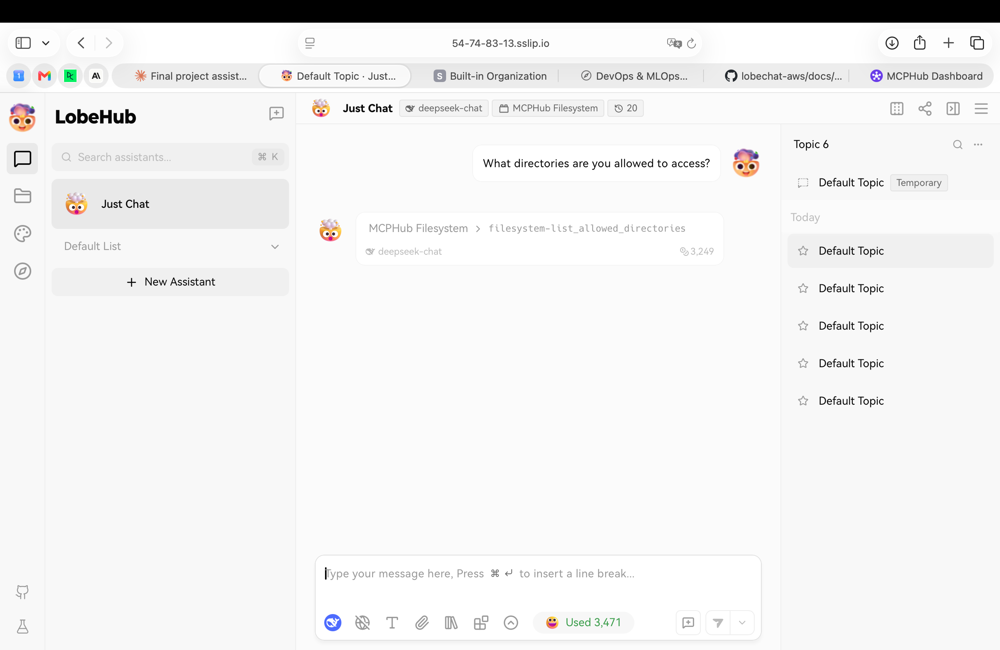
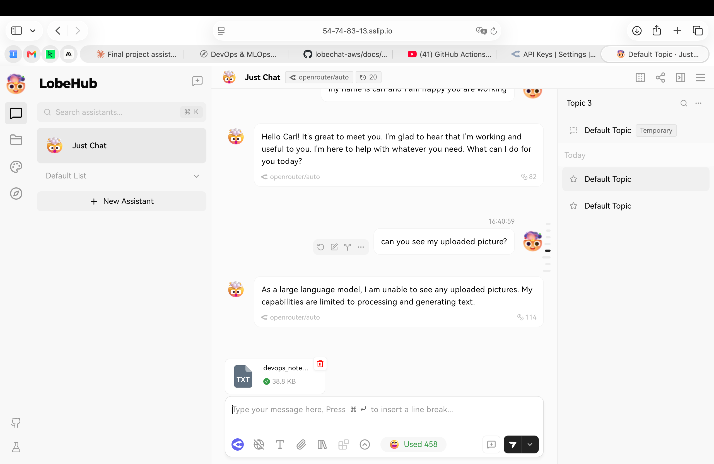
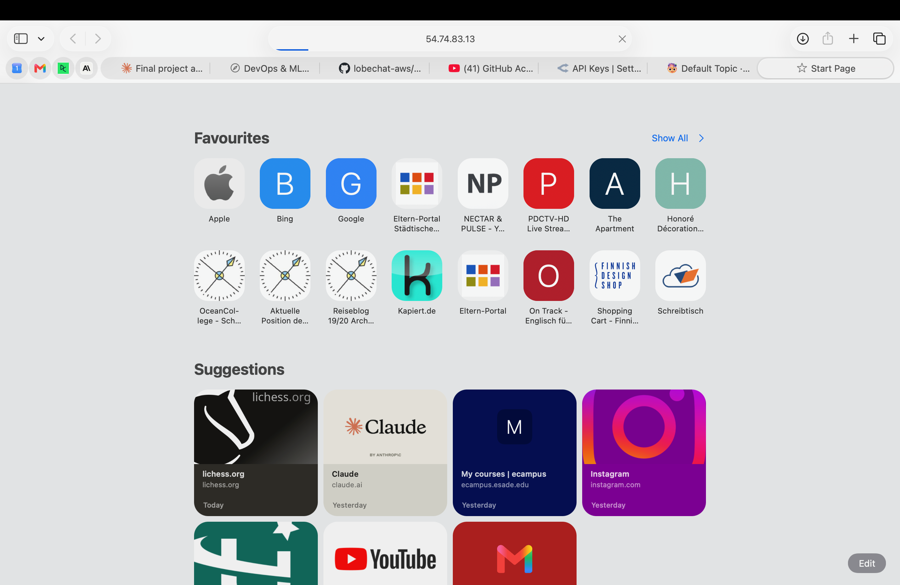

# TLS Validation Evidence

**Date:** 2026-06-02  
**Public URL:** https://54-74-83-13.sslip.io  
**DNS method:** sslip.io (wildcard IP-to-DNS resolution)  
**TLS provider:** Let's Encrypt (via Caddy HTTP-01 ACME challenge)  
**Reverse proxy:** Caddy v2, running as systemd service on EC2  

---

## Validation Checklist

### ✅ 1. Casdoor login flow completes from the public URL

Casdoor SSO login at `https://casdoor.54-74-83-13.sslip.io` presents the login form over HTTPS and redirects correctly to LobeChat after authentication. No `Secure cookie`, `SameSite`, or `redirect_uri` errors. Profile page confirms Casdoor account is connected.




### ✅ 2. LobeChat chat streaming works

Response tokens arrive incrementally via SSE through the Caddy HTTPS proxy. Confirms the SSE streaming path is not blocked by the TLS termination layer.



### ✅ 3. MCP tool invocation returns a result

MCP tool (MCPHub Filesystem → `filesystem-list_allowed_directories`) was invoked from chat using deepseek-chat and returned a result (3,249 tokens). Confirms long-lived MCP transport works through the Caddy reverse proxy over HTTPS.



### ✅ 4. File upload to MinIO from chat works

File (`devops_note...`, 38.8 KB TXT) uploaded via LobeChat chat interface, stored in MinIO at `https://minio.54-74-83-13.sslip.io`. Confirms request size and timeout settings are adequate through the proxy.



### ✅ 5. Direct connection to EC2 origin is rejected

Port 47000 is blocked by the security group. Direct access to the EC2 IP bypassing the Caddy proxy times out (browser shows start page, not LobeChat):



```
$ curl -v --max-time 5 http://54.74.83.13:47000/
*   Trying 54.74.83.13:47000...
* Connection timed out after 5004 milliseconds
* Closing connection
curl: (28) Connection timed out after 5004 milliseconds
```

### ✅ 6. Valid certificate chain on public hostname

Browser shows a valid certificate issued by Let's Encrypt (public CA). No warnings, no self-signed certificate. HTTPS padlock visible in address bar.


```
$ curl -sI https://54-74-83-13.sslip.io/
HTTP/2 307
alt-svc: h3=":443"; ma=2592000
date: Tue, 02 Jun 2026 17:53:13 GMT
location: /chat
via: 1.1 Caddy
```

---

## Subdomains Secured

| Subdomain | Service | Status |
|---|---|---|
| `https://54-74-83-13.sslip.io` | LobeChat | ✅ Valid cert |
| `https://casdoor.54-74-83-13.sslip.io` | Casdoor SSO | ✅ Valid cert |
| `https://minio.54-74-83-13.sslip.io` | MinIO console | ✅ Valid cert |
| `https://mcphub.54-74-83-13.sslip.io` | MCPHub | ✅ Valid cert |
